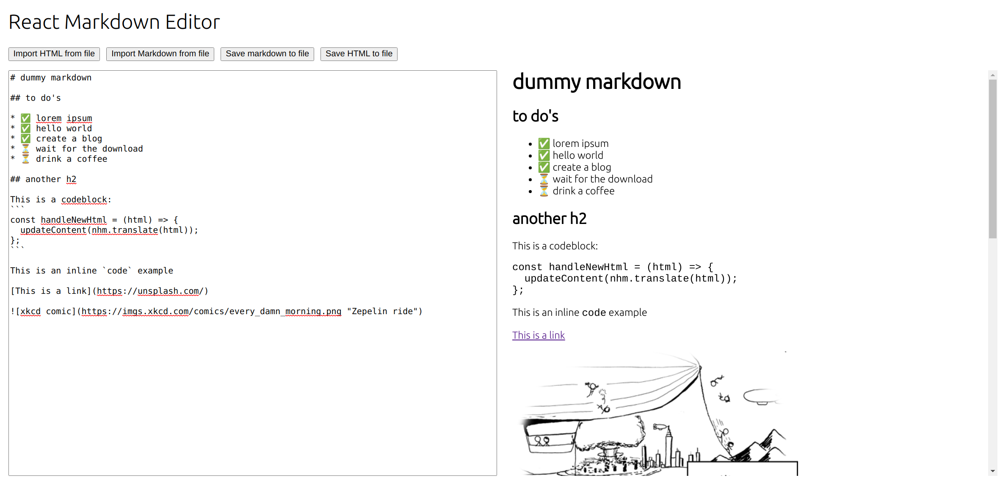

# React Markdown Editor

A WYSIWYG markdown editor that can save and read content in either markdown or html format.
Custom file handlers can be added in order to read from JSON or other file structures.

## Preview as of January 1st 2022



## Custom import buttons

Custom import buttons can be passed into the component through an array of objects. Each button needs an Object with a handler for the file content.

### Example of a file content handler
```
const customFileContentHandler = (fileContent) => {
  const parsed = JSON.parse(fileContent);
  return parsed.content;
};
```

### Example of
```
const dummyCustomImportButtons = [
  {
    wording: "Import from blog file",
    customFileContentHandler,
    allowedFileType: "json",
  },
];
```
